## Forget-Me-Not
Forget me not is designed to help with remembering tasks, utilizing a to do lits, establishing good habits, 
using a habit tracker and keeping track of work hours, with the option to remind the user when the workday 
is over to establish healthy work/life balance.

## Features
### Floating Menu
The apps menu is located in a floating action button.
* The FAB can be positioned as the user pleases but not outisde the screen
* The FAB retains its position when the app is restarted

### To Do List
The to do list is a simple list of current tasks to track.

  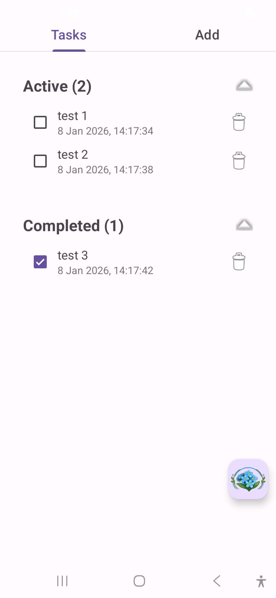
  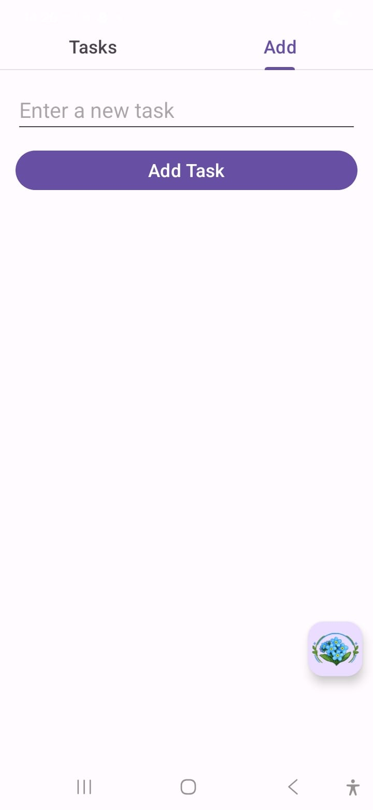

* Add Tasks
* Delete tasks
* Check tasks when they are done
* Keep track of Active and Completed tasks.

### Habit Tracker
A habit has a name, a description, a goal and a list of week days.

  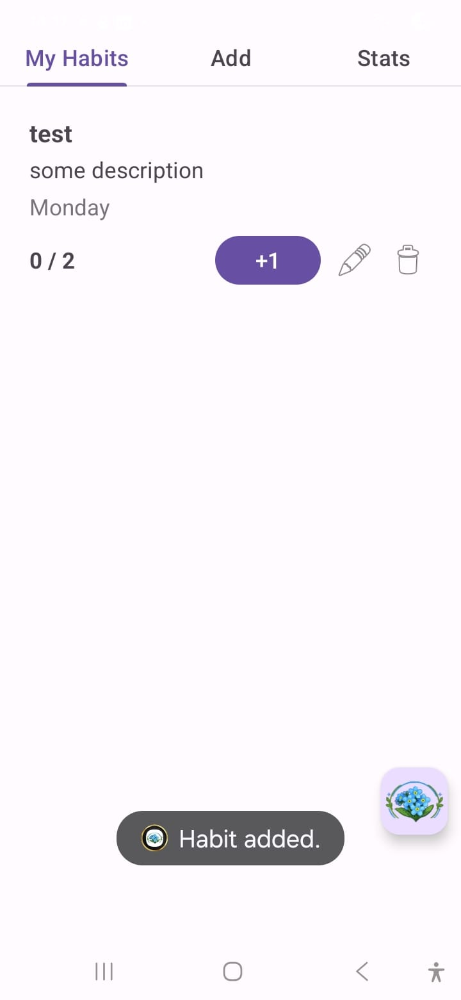
  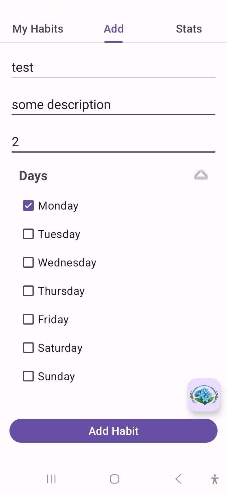
  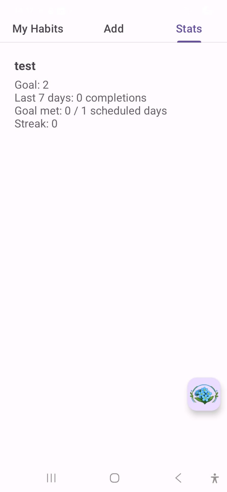
  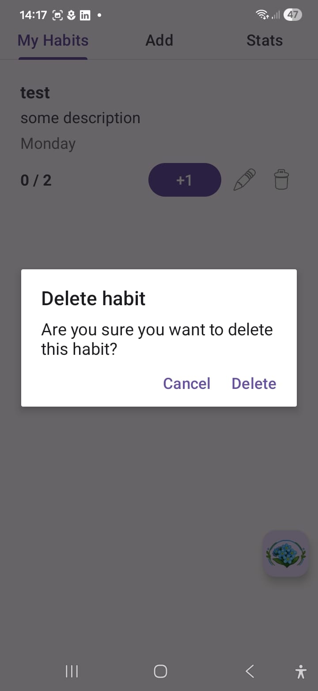
  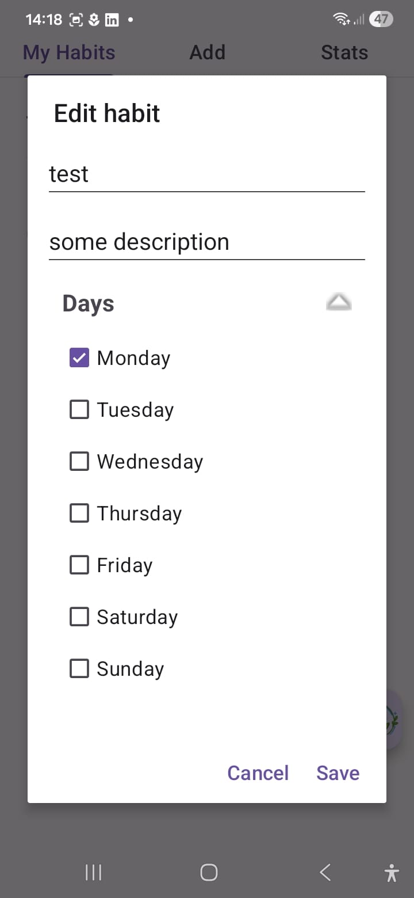

* My Habits overview
  * Displays a list of habits
  * Each habit is marked with 1 to 3 🔥, indicating 7, 14 and 21+ days completion streaks.
  * Edited habit
  * Deleted habit
  * Completion tracker
  * Completion adder
*  Add Habit
*  Stats
   * Goal
   * Last 7 days
   * Goal Met: (n/m) scheduled days
   * Streak
  
### Workflow
Workflow is meant to help keeping track of worktime and overtime.

  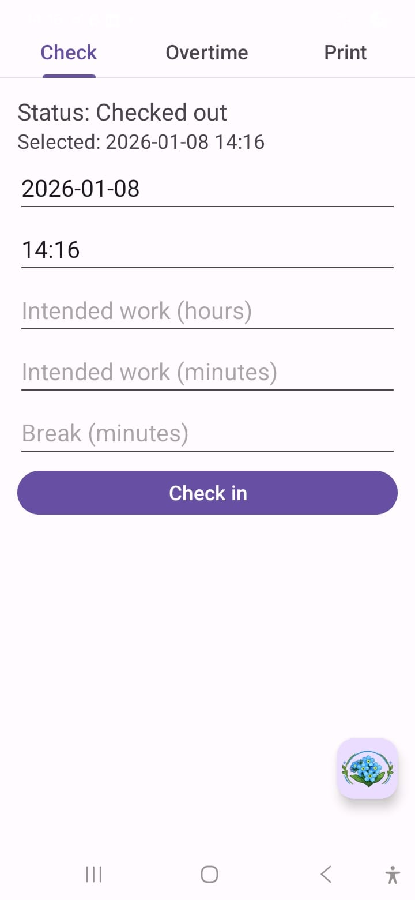
  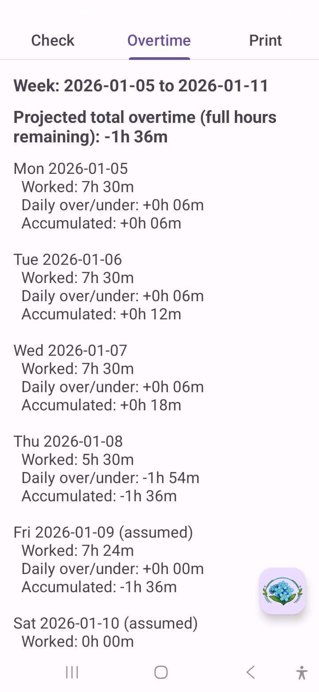
  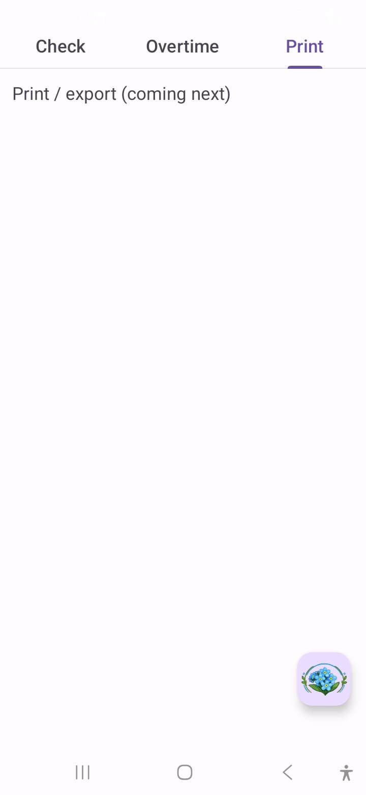
  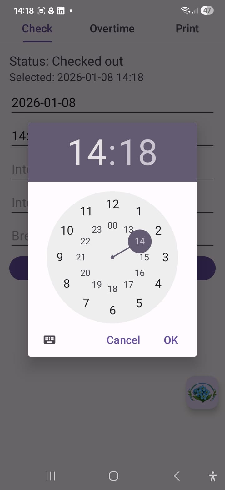
  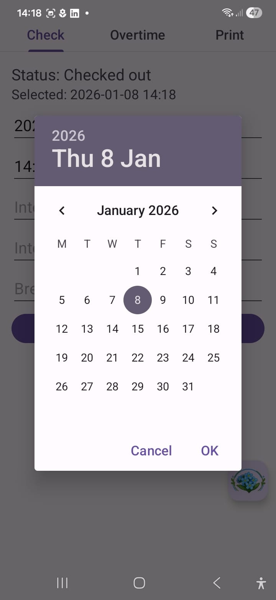
  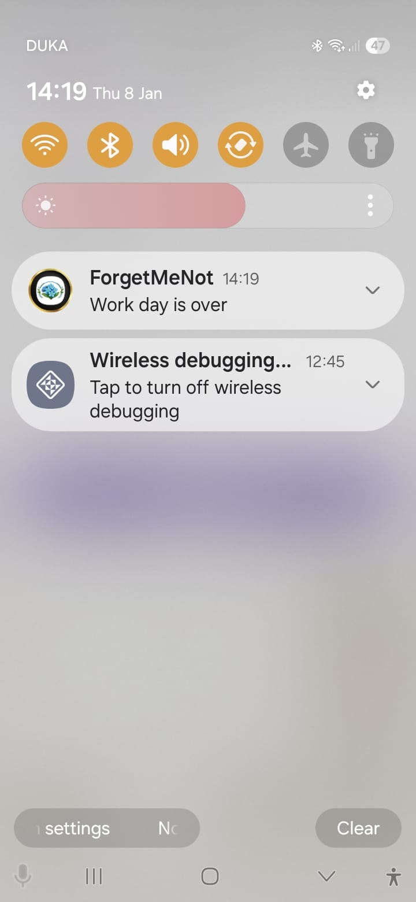

* Check
  * Status: Whehter the user is currently checked in or not.
  * Selected: The checked in date or the date to checkin on.
  * select date
  * select time
  * set intended work hours (converted to minutes)
  * set intended work minutes (added to the hours)
  * break minutes (subtracted from the total worked hours
  * alert the user when the planed workday is over 
* Overtime
  * Week: This week
  * Projected total overtime: an indication of the users total overtime, assumes the user will work 1/5th total weeks workhours each unset weekday.
  * displays each day of the week with: date, hours worked, daily over/under and accumulated overtime.
* Print
  * ToDo: this tab will make the user able to print the users workflow data to pdf.

### Settings
* Not yet implemented

### Info

  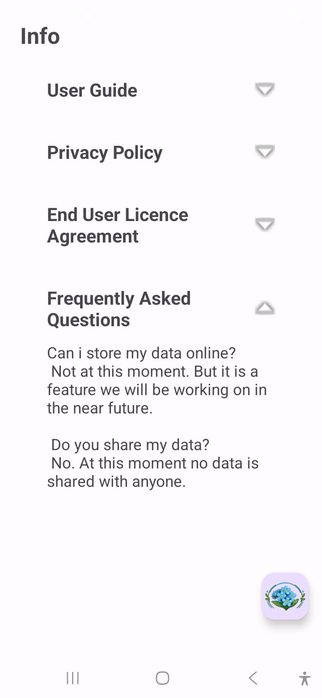

* Userguide
* Privacy Policy
* EULA
* FAQ

### Future Updates
https://trello.com/invite/b/695f6f2b35a42195416ca08c/ATTI1e459c213c0e590ec3c4a896219662cdD2732655/forget-me-not
